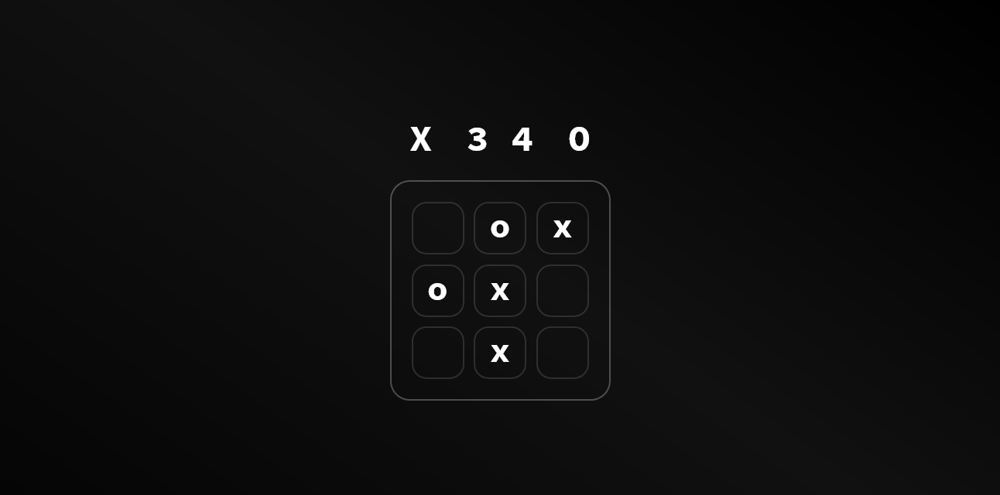
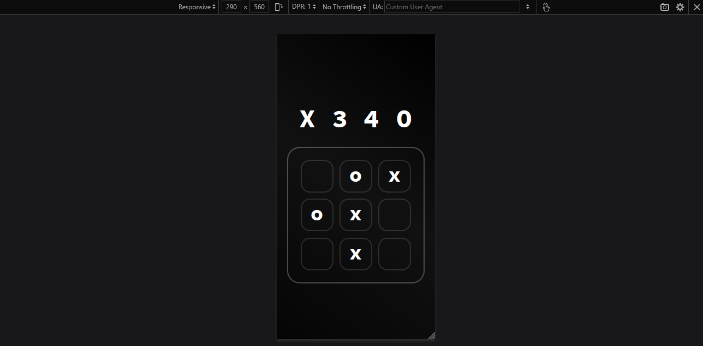

## Запуск
- Для установки зависимостей используйте команду ```npm install```
- Для запуска проекта, воспользуйтесь командной ```npm start```

---

## Интерфейс
- Игра совместима как с десктопными так и с мобильными устройствами.

# Предварительный просмотр
- Вид с десктопного устройства
---

- Вид с мобильного устройства
---

